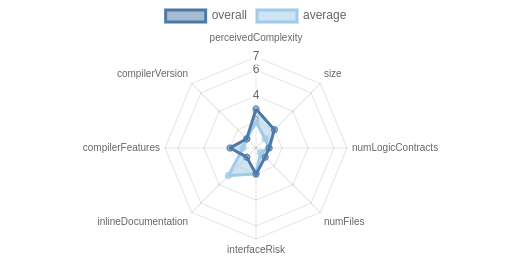
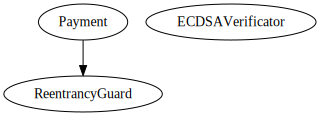
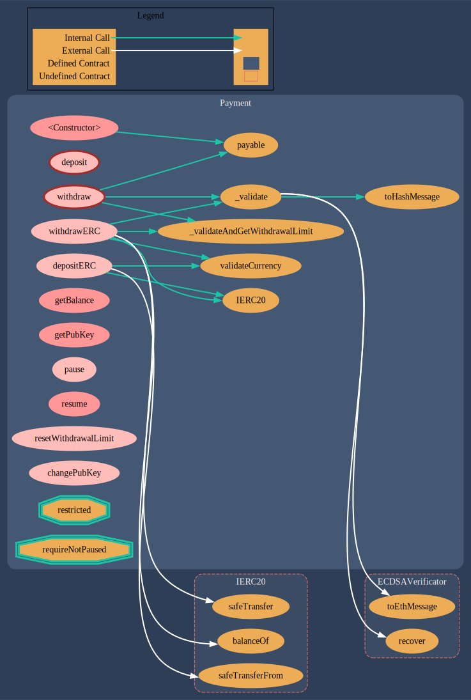

# bitbet-smart-contracts &nbsp; <br/> [![Hardhat][hardhat-badge]][hardhat] &nbsp; [![License: MIT][license-badge]][license]

```rs
./contracts/
├── ECDSAVerificator.sol
└── PaymentsSolDec082022.sol
```

---

### _██_ &nbsp; &nbsp; Acknowledgements &nbsp; &nbsp; _██████████████_

##### _This project was built on top of [Paul Berg][paulrberg]'s awesome [hardhat template][hardhat-templace]._

<!-- add shoutout to primitive-finance dodoc and consensys dilligence tooling (botar surya) -->

- [Hardhat](https://github.com/nomiclabs/hardhat): compile,
  run and test smart contracts
- [TypeChain](https://github.com/ethereum-ts/TypeChain):
  generate TypeScript bindings for smart contracts
- [Ethers](https://github.com/ethers-io/ethers.js/): renowned
  Ethereum library and wallet implementation
- [Solhint](https://github.com/protofire/solhint): code linter
- [Solcover](https://github.com/sc-forks/solidity-coverage):
  code coverage
- [Prettier Plugin Solidity](https://github.com/prettier-solidity/prettier-plugin-solidity):
  code formatter

<br>

### _██_ &nbsp; &nbsp; Sensible Defaults &nbsp; &nbsp; _████████████████_

**_NOTE:_** There are sensible default configurations in the
following files:

```sh
├── .commitlintrc.yml
├── .editorconfig
├── .eslintignore
├── .eslintrc.yml
├── .gitignore
├── .prettierignore
├── .prettierrc.yml
├── .solcover.js
├── .solhintignore
├── .solhint.json
├── .yarnrc.yml
└── hardhat.config.ts
```

<br>

### _██_ &nbsp; &nbsp; SM Overview &nbsp; &nbsp; _██████████████████_

### **Components**

| Contracts | Libraries | Interfaces | Abstract |
| --------- | --------- | ---------- | -------- |
| 1         | 1         | 0          | 0        |

### **Functions**

| Public | Payable | External |
| ------ | ------- | -------- |
| 10     | 2       | 7        |

| Internal | Private | Pure | View |
| -------- | ------- | ---- | ---- |
| 12       | 3       | 4    | 4    |

### **State Variables**

| Total | Public |
| ----- | ------ |
| 13    | 0      |

### **Solidity pragmas used** <br>

`>=0.8.0 <0.9.0`; &nbsp; `>=0.7.0 <0.9.0`.

### **Attributes**

- [x] Able to receive funds
- [x] Uses EVM Assembly calls
- [x] Contains hash functions
- [x] Able to transfer ETH
- [x] Uses ECRecover
- [ ] Contains call failure handling (try/catch)
- [ ] Able to create new contracts (Create/Create2)
- [ ] Uses unchecked arithmetics
- [ ] Contains suicidal/destroyable contracts
- [ ] Contains low-level calls
- [ ] Contains delegatecalls

---

<br>

### _██_ &nbsp; &nbsp; Risk Specs &nbsp; &nbsp; _██████████████████_

<div style="
    background-color: #ffffff;
    text-align: center; 
    width: 400px; 
    height: 250px">

&nbsp; &nbsp; **** &nbsp; &nbsp;

</div>

<br>

### _██_ &nbsp; &nbsp; Inheritance (C3 linearization) &nbsp; &nbsp; _██████████████████_

<div style=" width: 400px; background-color: #ffffff">

&nbsp; &nbsp; **** &nbsp;
&nbsp;

</div>

---

<br>

### _██_ &nbsp; &nbsp; SM Callgraph &nbsp; &nbsp; _██████████████████_

**_NOTE:_** In-depth per-method analysis can be found in
[docs](smart-contracts/docs/Payment.md).

<div style="height: 350px, width: 350px">



</div>

---

<br>

### _██_ &nbsp; &nbsp; Usage &nbsp; &nbsp; _███████████████████████_

  ### You can automate all steps (setting your configs, installing the project, compiling with type generation, running unit tests on Mainnet fork) by running this script and properly filling in the prompted fields:
  
  ```sh
  $ ./init.sh
  ```
**Or do it all manually:**
<br>

#### &nbsp; &nbsp; _█_ &nbsp; **Pre Requisites**

> - Before installing, create a `.env` file and set a BIP-39
>   compatible **mnemonic** and other env criteria as in
>   `.env.example`.
> - Then, proceed with installing dependencies:

```sh
$ yarn install
```

#### &nbsp; &nbsp; _█_ &nbsp; **Compile**

Compile the smart contracts with Hardhat:

```sh
$ yarn compile
```

**_NOTE:_** TypeChain artifacts generated at compile time.

#### &nbsp; &nbsp; _█_ &nbsp; **Deploy**

Deploy the contracts to a specified network:

```sh
$ yarn deploy
    --daily-withdrawal-limit "{INSERT_VAL}"
    --public-key "{INSERT_VAL}"
    --network {INSERT_NETWORK_NAME}
```

#### &nbsp; &nbsp; _█_ &nbsp; **Test**

Run the tests with Hardhat:

> - Don't forget to add an [**Alchemy API Key**][alchemy] to
>   your `.env` in order to be able to run unit tests against
>   an Ethereum Mainnet fork.

```sh
$ yarn test
```

**_NOTE:_** See the gas usage per unit test and average gas
per method call:

```sh
$ REPORT_GAS=true yarn test
```

#### &nbsp; &nbsp; _█_ &nbsp; **Coverage**

Generate the code coverage report:

```sh
$ yarn coverage
```

**_NOTE:_** To view the coverage report generated by
`yarn coverage`, just click `Go Live` from the status bar to
turn the server on/off.

#### &nbsp; &nbsp; _█_ &nbsp; **Clean**

Delete the smart contract artifacts, the coverage reports and
the Hardhat cache:

```sh
$ yarn clean
```

## License

[MIT](./LICENSE.md)

[alchemy]:
  https://auth.alchemy.com/signup?redirectUrl=https%3A%2F%2Fdashboard.alchemy.com%2Fsignup%2F%3Freferrer_origin%3Dhttps%3A%2F%2Fwww.google.com%2F
[paulrberg]: https://github.com/paulrberg
[hardhat-templace]:
  https://github.com/paulrberg/hardhat-template
[hardhat]: https://hardhat.org/
[hardhat-badge]:
  https://img.shields.io/badge/Built%20with-Hardhat-FFDB1C.svg
[license]: https://opensource.org/licenses/MIT
[license-badge]:
  https://img.shields.io/badge/License-MIT-blue.svg
