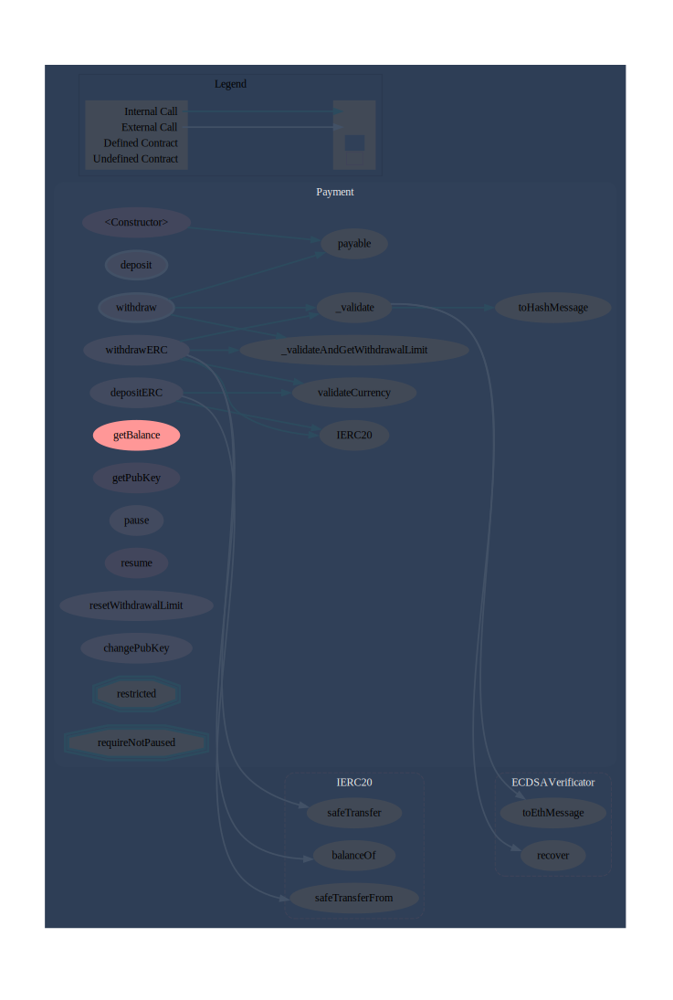

# Payment


### External Contract Calls Legend
| Symbol 	| Meaning                      	|
|--------	|------------------------------	|
| 🛑      	| Function can modify state    	|
| 🔐      	| Private or Internal function 	|


## Methods

<br>

### changePubKey

```solidity
function changePubKey(bytes pubKey) external nonpayable
```

Owner restricted method that updates the `pubKey` state variable.

*Control flow ensures that the `publicKey` state variable will not be updated for a minimum of 180 days following the last time `withdraw` or `withdrawERC` were called.Function reverts if the bytes default value is passed in (i.e., 0x00).This function is not referenced in any other methods.Function sighash := 0x8b93f545*

#### Parameters

| Name | Type | Description |
|---|---|---|
| pubKey | bytes | undefined |

#### Function Trace
```rs
└─ Payment::changePubKey
```

#### Control Flow


#### Callgraph


---

### deposit

```solidity
function deposit(uint256 userId) external payable
```

Method that enables an external actor to deposit ETH into the contract.

*Since this contract doesn&#39;t have any receive/payable fallback logic, this method and the `withdraw` function are the only standard ways for the contract to receive ETH.Note that there are still inderect ways to force ETH into the contract.`msg.sender` and `msg.value` also emitted in the `Deposited` event.This function is not referenced in any other methods.Function sighash := 0xb6b55f25*

#### Parameters

| Name | Type | Description |
|---|---|---|
| userId | uint256 | An deposit user identifier not written to contract&#39;s storage; and emitted in the `Deposited` event. |

#### Function Trace
```rs
└─ Payment::deposit 
  └─ Payment::payable
```

#### Control Flow


#### Callgraph


---

### depositERC

```solidity
function depositERC(uint256 amount, address tokenAddress, uint8 currency, uint256 userid) external nonpayable
```

Method that enables an external actor to deposit WBTC or USDC into the contract.

*Allowances/Approvals must be set in the token&#39;s contract for the transfer to go through.This function is not referenced in any other methods.Function sighash := 0xb70f307c*

#### Parameters

| Name | Type | Description |
|---|---|---|
| amount | uint256 | The amount of an token wished to be deposited into the contract. Paremeter emitted by the `ERC20Depoisted` event. |
| tokenAddress | address | The address of the token that is intended to be deposited into the contract. This value gets paired with the provided currency value in order to check that the path resolved by the `validateCurrency` function is valid. Parameter emitted by the `ERC20Depoisted` event. |
| currency | uint8 | The selected currency uint8 value (i.e., 0 := WBTC, 2 := USDC) to be path resolved with its `tokenAddress` pairing by the `validateCurrency` function. |
| userid | uint256 | undefined |

#### Function Trace
```rs
└─ Payment::depositERC
   ├─ Payment::validateCurrency | [Priv] 🔐  
   ├─ IERC20::safeTransferFrom | [Int] 🔒  🛑 
   ├─ ReentrancyGuard::_nonReentrantBefore | [Priv] 🔐  🛑 
   └─ ReentrancyGuard::_nonReentrantAfter | [Priv] 🔐  🛑 
```

#### Control Flow


#### Callgraph


---

### getBalance

```solidity
function getBalance() external view returns (uint256)
```

Public contract&#39;s balance getter.

*This function is not referenced in any other methods.Function sighash := 0x12065fe0*


#### Returns

| Name | Type | Description |
|---|---|---|
| _0 | uint256 | undefined |

#### Function Trace
```rs
└─ Payment::getBalance
```

#### Control Flow


#### Callgraph


---

### getPubKey

```solidity
function getPubKey() external view returns (address)
```

Public getter for the private `pubkeyaddress` state variable.

*This function is not referenced in any other methods.Function sighash := 0x4ad02ef1*


#### Returns

| Name | Type | Description |
|---|---|---|
| _0 | address | undefined |

#### Function Trace
```rs
└─ Payment::getPubKey
```

#### Control Flow


#### Callgraph


---

### pause

```solidity
function pause(uint256 amountSeconds) external nonpayable
```

Owner restricted function that pauses all functions restricted by the `requireNotPaused` modifier (`deposit`, `withdraw`, `deposit` and `depositERC`).

*`pausedTimestamp` will be updated by the current block.timestamp of this function call.`pausedFor` will be updated by the provided value of parameter `amountSeconds` as long as 0 is not passed in as its value.This function is not referenced in any other methods.Function sighash := 0x136439dd*

#### Parameters

| Name | Type | Description |
|---|---|---|
| amountSeconds | uint256 | undefined |

#### Function Trace
```rs
└─ Payment::pause
```

#### Control Flow


#### Callgraph


---

### resetWithdrawalLimit

```solidity
function resetWithdrawalLimit() external nonpayable
```

External method callable each 24 hours that resets the daily withdrawal limit to its initial value.

*This function is not referenced in any other methods.Function sighash := 0x9c9de1b7*

#### Function Trace
```rs
└─ Payment::resetWithdrawalLimit
```

#### Control Flow


#### Callgraph


---

### resume

```solidity
function resume() external nonpayable
```

Owner restricted function that unpauses/resumes all functions restricted by the `requireNotPaused` modifier (`deposit`, `withdraw`, `deposit` and `depositERC`).

*`pausedTimestamp` will be reset to 0 via this function call.This function is not referenced in any other methods.Function sighash := 0x046f7da2*

#### Function Trace
```rs
└─ Payment::resume
```

#### Control Flow


#### Callgraph


---

### withdraw

```solidity
function withdraw(uint256 amount, uint256 nonce, address receiver, uint8 currency, bytes32 txid, bytes signature) external payable
```

ETH withdraw method that also receives ether.

*Since this contract doesn&#39;t have any receive/payable fallback logic, this method and the `deposit` function are the only standard ways for the contract to receive ETH.Note that there are still inderect ways to force ETH into the contract.Both `withdraw` and `withdrawERC` use the same nonce whilst validating messages and checking against storage within control flow.Frontend should estimate the `nonceState` through event emission of both `withdraw` and `withdrawERC` functions; since the contract does not provide a way to fetch such state variable.This function is not referenced in any other methods.Function sighash := 0x11bd1621*

#### Parameters

| Name | Type | Description |
|---|---|---|
| amount | uint256 | The amount of ETH wished to be withdrawn from contract&#39;s balance. This parameter will be checked against the contract balance within the control flow; provided as part of the signed message to be validated; and then converted to the WBTC scalar (1e8), so to be decreased, as `limitInWBTCBaseUnits`, from the `dailyWithdrawalLimitInWBTCBaseUnits` state variable. Parameter emitted in event `Withdraw`. |
| nonce | uint256 | The nonce value used as a counter to prevent signature replay attacks; must be always less than current `nonceState` value +1. This value will return true if provided as a key entry of the nonces mapping once this function call is succeeded. |
| receiver | address | The address entitled to receive the withdrawn contract balance. This parameter is provided as part of the signed message to be validated by `_validate` fx; then used in low level call as the recipient for where the funds will be sent to. Parameter emitted in event `Withdraw`. |
| currency | uint8 | The 8 bit unsigned integer that will revert within control flow if its value isn&#39;t 1. The value gets provided as part of the signed message to be validated; then, the parameter serves as path selector for the `_validateAndGetWithdrawalLimit` function. |
| txid | bytes32 | The `bytes32` transaction identifier only used for signed message validation. |
| signature | bytes | The offchain generated signature used in `ecrecover`. Constituted by the concatenation of the splitted signature (i.e., r,s,v). |

#### Function Trace
```rs
└─ Payment::withdraw
   ├─ Payment::_validate | [Priv] 🔐  🛑 
   │  ├─ Payment::toHashMessage | [Int] 🔒   
   │  ├─ ECDSAVerificator::toEthMessage | [Int] 🔒   
   │  └─ ECDSAVerificator::recover | [Int] 🔒   
   ├─ Payment::_validateAndGetWithdrawalLimit | [Int] 🔒   
   └─ Payment::payable
```

#### Control Flow


#### Callgraph


---

### withdrawERC

```solidity
function withdrawERC(uint256 amount, uint256 nonce, address tokenAddress, uint8 currency, address receiver, bytes32 txid, bytes signature) external nonpayable
```

WBTC or USDC withdraw method.

*Frontend should estimate the `nonceState` through event emission of both `withdraw` and `withdrawERC` functions; since the contract does not provide a way to fetch such state variable.Both `withdraw` and `withdrawERC` use the same nonce whilst validating messages and checking against storage within control flow.This function is not referenced in any other methods.Function sighash := 0xc1678cd8*

#### Parameters

| Name | Type | Description |
|---|---|---|
| amount | uint256 | The amount of the selected ERC20 token wished to be withdrawn from this contract. This parameter will be checked against the contract&#39;s ERC20 balance within the control flow; provided as part of the signed message to be validated by the `_validate` private function; converted to the scalar of WBTC (1e8) if the currency equals 2 (USDC); then checked against the daily withdrawal limit by the `_validateAndGetWithdrawalLimit` internal function. In case of passing all requirements, this parameter&#39;s value is then transfered to the receiver and logged in the `ERC20Withdraw` event. |
| nonce | uint256 | The nonce value used as a counter to prevent signature replay attacks; must be always less than current `nonceState` value +1. This value will return true if provided as a key entry of the nonces mapping once this function call is succeeded. |
| tokenAddress | address | The address of the token that is intended to be deposited into the contract. This value gets paired with the provided currency value in order to check that the path resolved by the `validateCurrency` function is valid. Parameter emitted by the `ERC20Withdraw` event. |
| currency | uint8 | The selected currency uint8 value (i.e., 0 := WBTC, 2 := USDC) to be path resolved with its `tokenAddress` pairing by the `validateCurrency` function. The value gets provided as part of the signed message to be validated; then, the parameter serves as path selector for the `_validateAndGetWithdrawalLimit` function. |
| receiver | address | The address entitled to receive the withdrawn ERC20 balance. This parameter is provided as part of the signed message to be validated by `_validate` fx; then provided as the `to` parameter of the token&#39;s `safeTransfer` method. Parameter emitted in event `ERC20Withdraw`. |
| txid | bytes32 | The `bytes32` transaction identifier only used for signed message validation. |
| signature | bytes | The offchain generated signature used in `ecrecover`. Constituted by the concatenation of the splitted signature (i.e., r,s,v). |

#### Function Trace
```rs
└─ Payment::withdrawERC
   ├─ Payment::validateCurrency | [Priv] 🔐  
   ├─ IERC20::balanceOf | [Ext] ❗️   
   ├─ Payment::_validate | [Priv] 🔐  🛑 
   │  ├─ Payment::toHashMessage | [Int] 🔒   
   │  ├─ ECDSAVerificator::toEthMessage | [Int] 🔒   
   │  └─ ECDSAVerificator::recover | [Int] 🔒   
   ├─ Payment::_validateAndGetWithdrawalLimit | [Int] 🔒   
   └─ IERC20::safeTransfer | [Int] 🔒  🛑 
```

#### Control Flow


#### Callgraph


---

<br>

## Events

### Deposited

```solidity
event Deposited(address indexed sender, uint256 amount, uint256 userId)
```


*Event emitted by the `deposit` function.Event signature: (keccak256(bytes(&quot;Deposited(address,uint256,uint256)&quot;)) := 0x73a19dd210f1a7f902193214c0ee91dd35ee5b4d920cba8d519eca65a7b488ca*

#### Parameters

| Name | Type | Description |
|---|---|---|
| sender `indexed` | address | undefined |
| amount  | uint256 | undefined |
| userId  | uint256 | undefined |

### ERC20Deposited

```solidity
event ERC20Deposited(address from, uint256 amount, address tokenAddress)
```


#### Parameters

| Name | Type | Description |
|---|---|---|
| from  | address | undefined |
| amount  | uint256 | undefined |
| tokenAddress  | address | undefined |

### ERC20Withdraw

```solidity
event ERC20Withdraw(address to, uint256 amount, address tokenAddress)
```


*Event emitted by the `withdrawERC` function.Event signature: (keccak256(bytes(&quot;ERC20Withdraw(address,uint256,address)&quot;)) := 0xf6ec5aa090c5e0f965cb680d7b2bb31073063aa12e87945c18f82b616f8b0050*

#### Parameters

| Name | Type | Description |
|---|---|---|
| to  | address | undefined |
| amount  | uint256 | undefined |
| tokenAddress  | address | undefined |

### Validate

```solidity
event Validate(address recovered, address owner, enum ECDSAVerificator.ErrorType errorType)
```


*Unused event.*

#### Parameters

| Name | Type | Description |
|---|---|---|
| recovered  | address | undefined |
| owner  | address | undefined |
| errorType  | enum ECDSAVerificator.ErrorType | undefined |

### Withdraw

```solidity
event Withdraw(address receiver, uint256 amount)
```


*Event emitted by the `withdraw` function.Event signature: (keccak256(bytes(&quot;Withdraw(address,uint256)&quot;)) := 0x884edad9ce6fa2440d8a54cc123490eb96d2768479d49ff9c7366125a9424364*

#### Parameters

| Name | Type | Description |
|---|---|---|
| receiver  | address | undefined |
| amount  | uint256 | undefined |


